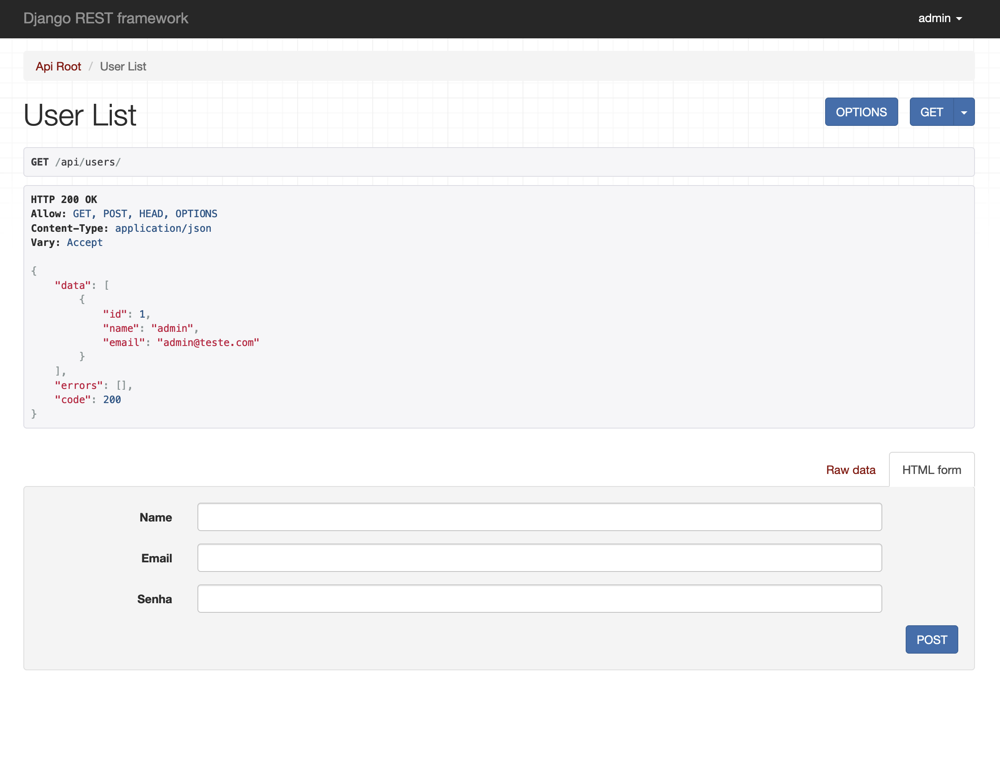

# UsersAPI

Este é um projeto de API de usuários, construído com Django e DRF (Django Rest Framework), inteiramente em Python. Pode
ser executado com o Docker.

## API navegável



## Como executar o projeto

1. Certifique-se de ter o [Docker](https://www.docker.com/products/docker-desktop/)
   e [Git](https://git-scm.com/book/en/v2/Getting-Started-Installing-Git) instalado em seu sistema antes de executar o
   projeto.

2. Certifique-se de que as portas **80 (default)** e **5432** esteja disponível em sua máquina antes de executar o
   projeto.

3. Clone o repositório em sua máquina local utilizando o comando `git clone https://github.com/thoggs/userApi.git`.

4. Navegue até a raiz do projeto no terminal.

5. Execute o seguinte comando para iniciar o projeto:

```bash 
docker-compose up -d
```

## Autenticação

Para ter acesso total à API, é necessário fazer login como um usuário com permissões administrativas. Para fazer isso,
siga as instruções abaixo:

1. Acesse a API navegável através do endereço [http://localhost/api](http://localhost/api).

2. Clique no botão "Login" na parte superior direita da página.

3. nsira suas credenciais de usuário administrador (email e senha).

- Se você ainda não criou um usuário administrador, crie um novo usuário utilizando o
  comando `docker exec -it web python manage.py createsuperuser`.

- Certifique-se de ter habilitado as permissões de autenticação no arquivo `settings.py`
  definindo `ENABLE_PERMISSIONS = True`.

- Se você quiser desabilitar as permissões de autenticação, defina `ENABLE_PERMISSIONS = False` no
  arquivo `settings.py`. Porém, isso não é recomendado para ambientes de produção.

Após o login, você terá acesso total à API.

## Licença

Este projeto está licenciado sob a [Licença MIT](https://opensource.org/license/mit/). Consulte o
arquivo [LICENSE](./LICENSE) para obter mais detalhes.
