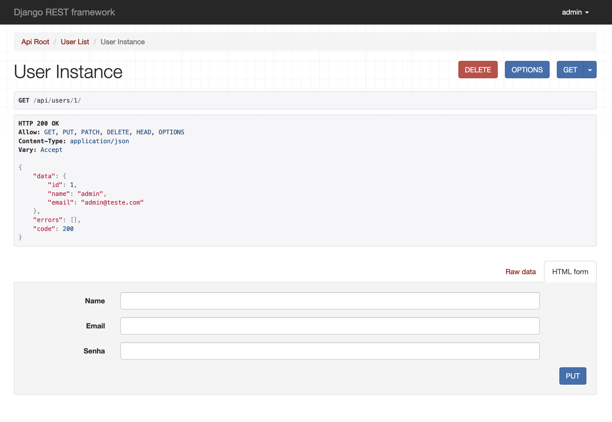

# UsersAPI

Este é um projeto de API de usuários, construido com Django e DRF (Django Rest Framework), inteiramente em Python. Pode ser executado com o Docker. 

## API navegável



## Como executar o projeto

1. Certifique-se de ter o Docker instalado em seu sistema antes de executar o projeto.
2. Clone o repositório em sua máquina local.
3. Navegue até a raiz do projeto no terminal.
4. Execute o seguinte comando para iniciar o projeto:

```bash 
docker-compose up -d
```

- Acesse a API através do endereço [http://localhost/api/users](http://localhost/api/users)

Certifique-se de que as portas **80 (default)** e **5432** esteja disponível em sua máquina antes de executar o projeto.

## Licença

Este projeto está licenciado sob a [Licença MIT](https://opensource.org/license/mit/). Consulte o arquivo [LICENSE](./LICENSE) para obter mais detalhes.
